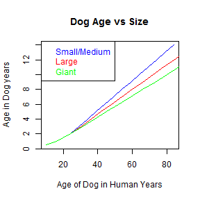

## Summary

This application has been created as a course project of the Developing Data Products course.

Have you ever asked yourselve how old your dog is? Well, you found to the right App...

* The Shiny App calculates the age and seniority of a dog based on its age in human years
* User must submit in the App the age and size of the dog.
* The application determines the age in Dog years and returns how old is your dog: puppy, young adult, middle age or senior.


--- .class #id 

## Building the App

Basic inputs were used to collect data as you can see in the section below


```r
library(shiny)

shinyUI(
   pageWithSidebar(
     #Application Title
        headerPanel("Dog Age Calculator"),
        sidebarPanel(
                selectInput('humanAge', 'Age in Human Years', choices = ageOptions),
                radioButtons('dogSize', "Choose the size of your dog", choices = sizes),
                submitButton('Submit')
        ),
```


--- .class #id 

## Inputs

The inputs for the App are contained in a global file. Let's see how the age of the dog depends as a function of the dog size:


```r
plot(SM, ageOptions,type = "l", col ="blue", xlab = "Age of Dog in Human Years", 
     ylab = "Age in Dog years", main = "Dog Age vs Size" )
lines(L,ageOptions, col = "red")
lines(G,ageOptions, col = "green")
legend("topleft", c("Small/Medium", "Large", "Giant"), text.col=c("blue", "red", "green"))
```

 


--- .class #id 

## Supporting Resources

More information on the Developing Data Products course project can be found here:
https://www.coursera.org/course/devdataprod

For more information about RStudio Shinyapps.io visit:
http://shiny.rstudio.com/articles/shinyapps.html


